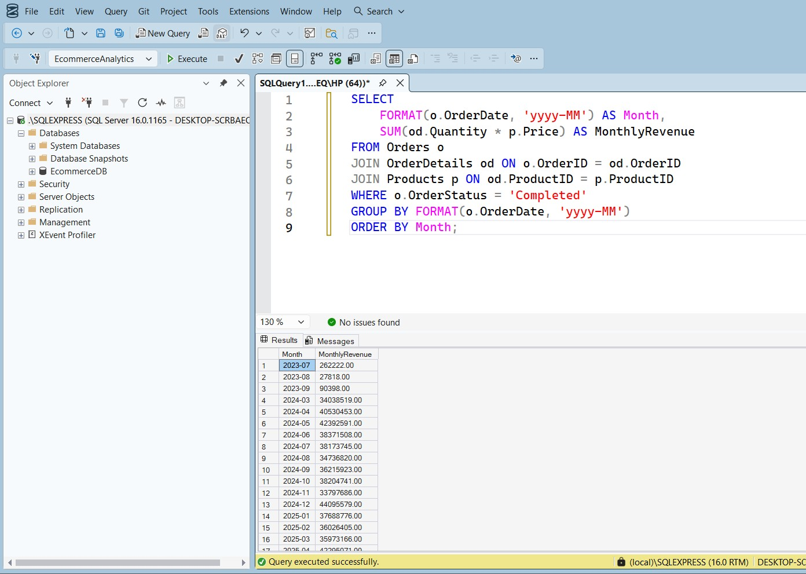
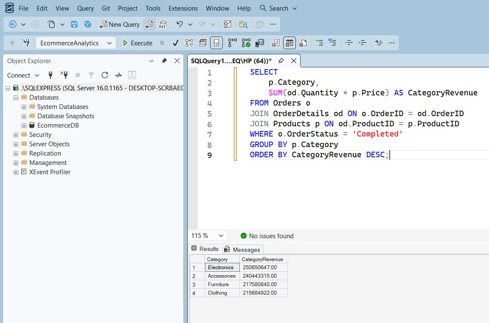

# 📊 E-Commerce Sales Analytics Dashboard | SQL + Power BI

## 📌 Project Overview

Developed an end-to-end e-commerce sales analytics solution using Microsoft SQL Server and Power BI.  

The project simulates a retail business environment and analyzes revenue trends, category performance, and top customer contribution to support data-driven decision-making.

---

## 🛠 Tools & Technologies

- Microsoft SQL Server (SSMS)
- SQL (JOINs, GROUP BY, CASE, CTEs, Window Functions)
- Indexing & Performance Optimization
- Microsoft Power BI
- DAX
- Relational Database Design

---

## 🗄 Database Design

Designed a structured relational database including:

- Customers  
- Products  
- Orders  
- OrderDetails  

Implemented:
- Primary & Foreign Key relationships  
- Bulk data generation (1000+ customers, 10,000+ orders, 25,000+ transactions)  
- Indexing on high-frequency columns for improved query performance  

---

## 📈 Business Analysis Performed

### 🔹 Monthly Revenue Trend
- Calculated monthly revenue using SQL aggregation
- Identified revenue growth patterns across time

---

### 🔹 Category-wise Revenue Analysis
- Analyzed revenue contribution by product category
- Ranked categories by total revenue

---

### 🔹 Top 5 Customers by Spending
- Used CTE and `RANK()` window function
- Identified high-value customers contributing maximum revenue

---

## 📊 Power BI Dashboard

Built an interactive dashboard featuring:

- Total Revenue KPI  
- Customer Count KPI  
- Monthly Revenue Trends  
- Category Performance Analysis  
- Customer Contribution Insights  
- Interactive filters and slicers  

---

## 🚀 Key Highlights

- Built scalable relational database architecture  
- Implemented advanced SQL analytics using JOINs and window functions  
- Optimized queries using indexing  
- Transformed backend SQL insights into executive-level dashboard  

---

## 💼 Business Value

This project demonstrates the ability to:

- Design and manage structured databases  
- Perform advanced SQL analysis  
- Generate actionable business KPIs  
- Translate data insights into visual decision-support tools  
